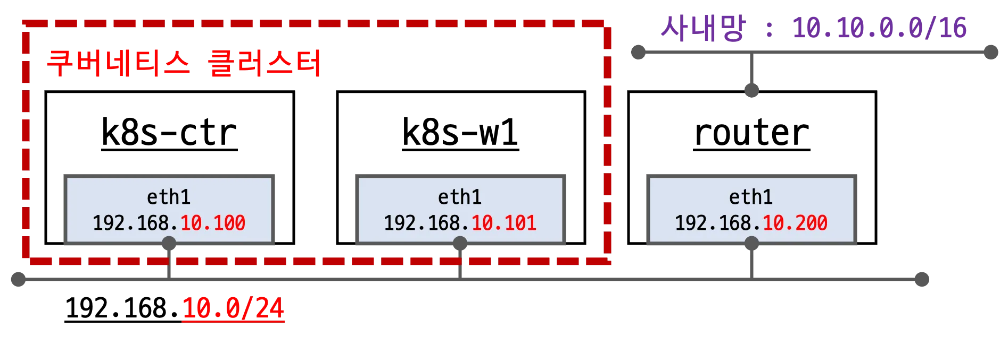

# Vagrant 로 k8s 테스트 환경 구축

## 최종 테스트 환경

초기 프로비저닝으로 아래 내용들 세팅 자동화

- kubeadm 및 kubelet 설치
- POD 및 Service CIDR 네트워크 대역 설정
- kubernetes 명령어 alias 설정
- 필요한 라이브러리 설치
- Hubble & Hubble Exporter 설치
- Prometheus & Grafana 설치

## 구성 요소
### 인터페이스
| 인터페이스 | 용도 |
| --- | --- |
| eth0 | ssh 접근 및 인터넷 접근 용도 |
| eth1 | 쿠버네티스 클러스터 네트워킹 구성 요소 |

### 참고사항
- 가상머신의 eth0 IP는 10.0.2.15 로 모두 동일
- kubeadm configuration YAML 파일로 kubeadm init 및 join 을 선언형식으로 변경

## 참고
[1] vagrant 파일 구성요소 : https://developer.hashicorp.com/vagrant/docs/vagrantfile/machine_settings

[2] kubeadm Configuration YAML 파일 : https://kubernetes.io/docs/reference/config-api/kubeadm-config.v1beta4/

모든 내용들은 Cilium 가시다 스터디 후 공부한 내용을 정리하였습니다. 스터디를 진행해주신 가시다님에게 감사의 말씀 드립니다.